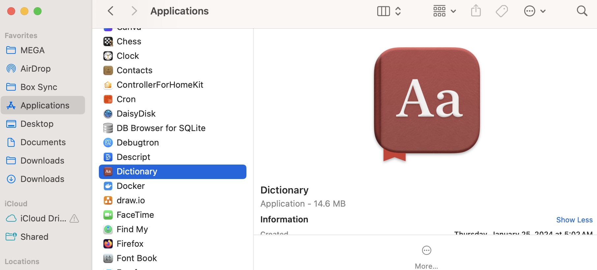
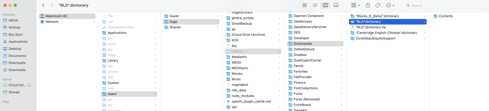
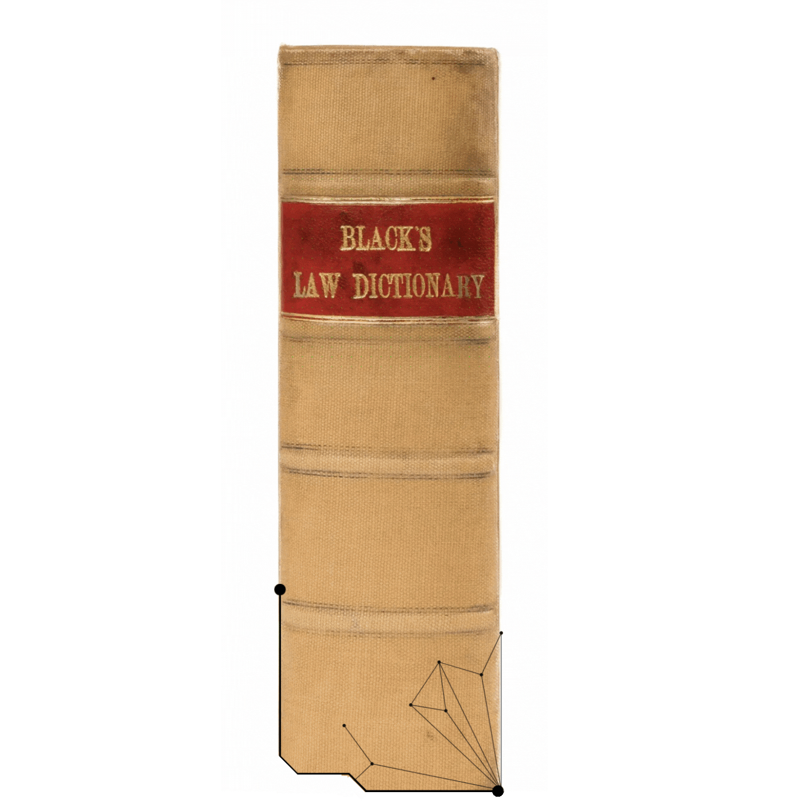

$$
\begin{align*}
\alpha BLD
\end{align*}
$$

---

This repo provides an accessible, yet outdated, version of [Black's Law Dictionary](https://search.worldcat.org/title/Black's-law-dictionary/oclc/44045815), which—as a primarily printed or digital but-hard-to-use resource—is not accessible to individuals with disabilities. By wrapping the dictionary in a ".dictionary" format, the user can receive offline, no-Internet-connectivity-required text-to-speech definitions, or use a screenreader, to explore the dictionary. 

<video controls="" width="800" height="500" muted="False" loop="" autoplay="True">
<source src="https://github.com/nathanReitinger/Blacks-Law-Dictionary/raw/master/media/aBLD_compressed.mp4" type="video/mp4">
</video>

:warning: **AS IS SOFTWARE**: There may be bugs! If you report them, then we can work on a patch :)

:warning: **NOT OFFICIAL**: Do not rely on this software to be accurate or complete

:warning: **Mac**: This dictionary is only for macOS

---

### How to install

To install the dictionary, which happens to be quite large (>30GB, due to the audio files), follow these steps: 

**STEP 1**: download the ".dictionary" from here ([link to dictionary](https://huggingface.co/datasets/nathanReitinger/alphaBLD/resolve/main/%E2%80%9CBLD%E2%80%9D.dictionary.zip?download=true)) ([source](https://huggingface.co/datasets/nathanReitinger/alphaBLD/blob/main/%E2%80%9CBLD%E2%80%9D.dictionary.zip))

**STEP 2**: open your own dictionary application (macOS applications) (called "Dictionary")

  

**STEP 3**: once "Dictionary" is open, on the top menu bar, click "file" then "Open Dictionaries Folder" (this will open a new Finder window)

**STEP 4**: put the .dictionary file (keep it zipped!) you downloaded in STEP 1 into the folder opened from STEP 2

**STEP 5**: unzip the file by double clicking on it (this might be slow!)

- make sure the "Dictionaries" folder contains the `“BLD”.dictionary` file, which should contain a folder called "Contents"
- you may delete the zip file

**STEP 6**: go back to the dictionary app, click on "Dictionary" in the top left corner of the top bar, then "Settings..." and then scroll down until you find "BLD" and  check that box

- you may need to close "Dictionary" and reopen it again for BLD to load

**STEP 7**: you now have it! you can search for words in the dictionary as an app, or use a three-finger click to call the dictionary on a webpage or PDF reader like Preview 

---

### Resources

- [How can I create a dictionary for Mac OS X](https://apple.stackexchange.com/questions/80099/how-can-i-create-a-dictionary-for-mac-os-x)

- [Add Custom Dictionary to MacOS](https://www.reddit.com/r/MacOS/comments/17notci/add_custom_dictionary_to_macos/)

- [Spanish to English and English to Spanish dictionary for Dictionary app?](https://apple.stackexchange.com/a/119166/240383)

- [CFWheels Dictionary for Mac OS X](http://blog.nagpals.com/cfwheels-dictionary/)

- Older dictionary source where terms came from; has changed since data was pulled ([sovereign connection dictionary](http://dictionary.sovereignconnection.com))

- [Looking for a good dictionary app](https://www.applevis.com/forum/ios-ipados/looking-good-dictionary-app)

- TTS (text-to-speech) from [StyleTTS2](https://arxiv.org/abs/2306.07691) see also [huggingFace repo](https://huggingface.co/spaces/styletts2/styletts2)

  
